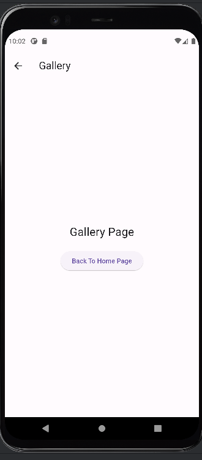

# TechChaps

TechChaps is a Flutter project showcasing navigation using a bottom navigation bar with different screens. It includes pages for the home, about us, contact us, and gallery.

## Screenshots

### Home Screen                                        ### About Us Screen
                 

### Contact Us Screen


### Gallery Screen


## Table of Contents

- [Features](#features)
- [Installation](#installation)
- [Usage](#usage)
- [Contributing](#contributing)
- [License](#license)

## Features

- **Bottom Navigation Bar**: Navigate between different screens using a bottom navigation bar.
- **Home Page**: Landing page providing an introduction to the app.
- **About Us Page**: Information about TechChaps, including its mission and services.
- **Contact Us Page**: Contact information for TechChaps, including address, phone number, and email.
- **Gallery Page**: Showcase of images or multimedia content.

## Installation

To run this project locally, ensure you have Flutter installed. Then, follow these steps:

1. Clone the repository:

    ```
    $ git clone https://github.com/your_username/techchaps.git
    ```

2. Navigate to the project directory:

    ```
    $ cd techchaps
    ```

3. Install dependencies:

    ```
    $ flutter pub get
    ```

4. Run the app:

    ```
    $ flutter run
    ```

## Usage

Once the app is running, you can use the bottom navigation bar to navigate between different screens:

- **Home**: Landing page providing an introduction to the app.
- **About Us**: Information about TechChaps, including its mission and services.
- **Contact Us**: Contact information for TechChaps, including address, phone number, and email.
- **Gallery**: Showcase of images or multimedia content.

## Contributing

Contributions to this project are welcome! If you'd like to contribute, please follow these guidelines:

1. Fork the repository and create your branch:

    ```
    $ git checkout -b feature/new-feature
    ```

2. Make your changes and commit them:

    ```
    $ git commit -am 'Add new feature'
    ```

3. Push to the branch:

    ```
    $ git push origin feature/new-feature
    ```

4. Submit a pull request.

## License

This project is licensed under the TechChaps.
